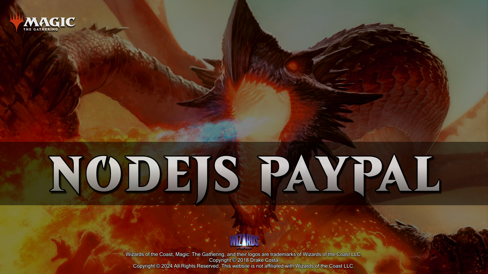
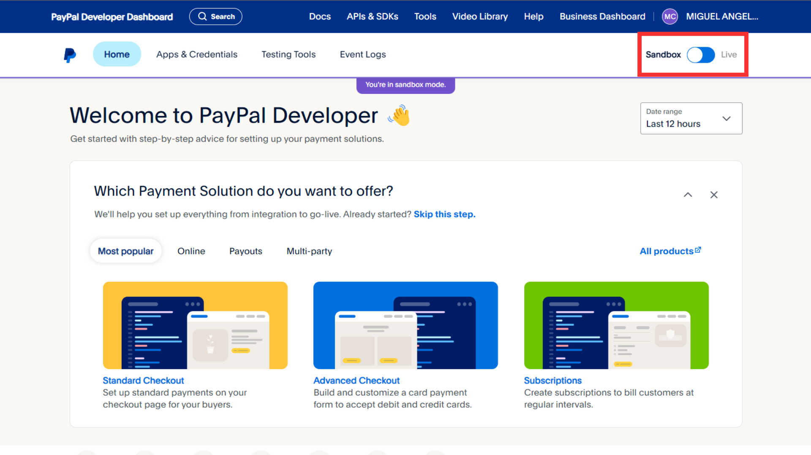
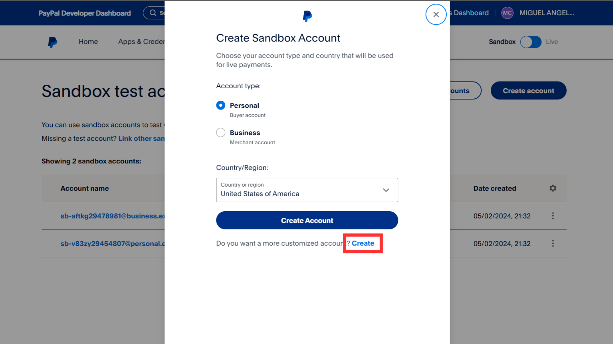
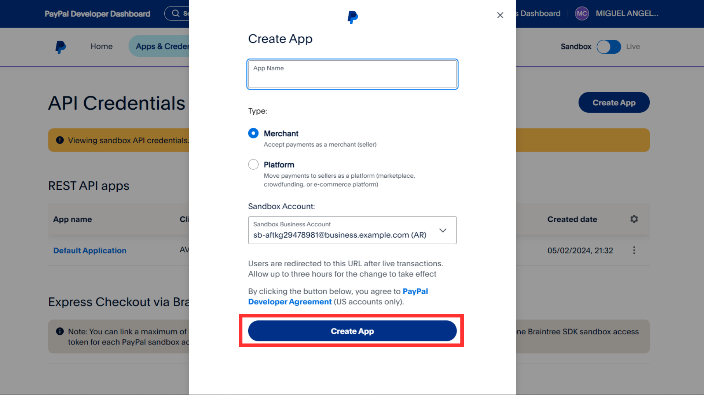
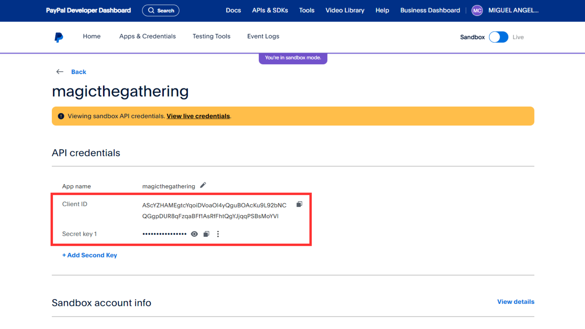
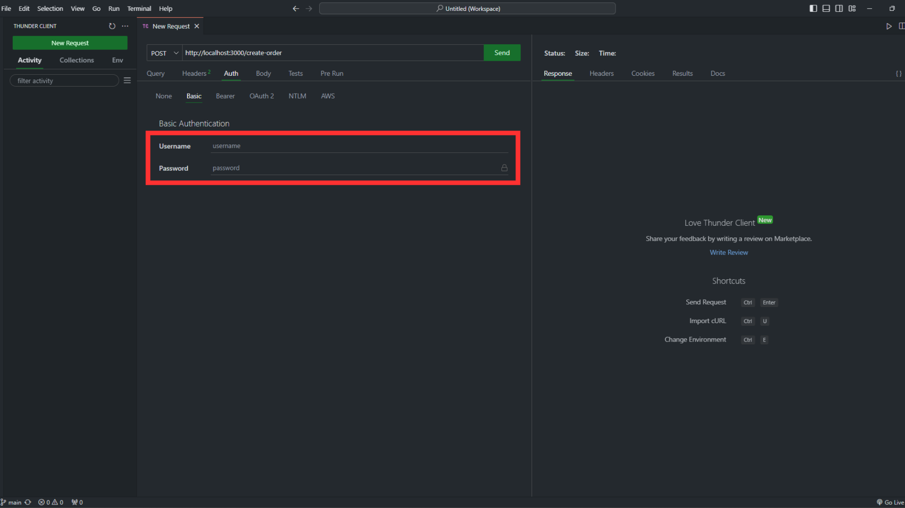
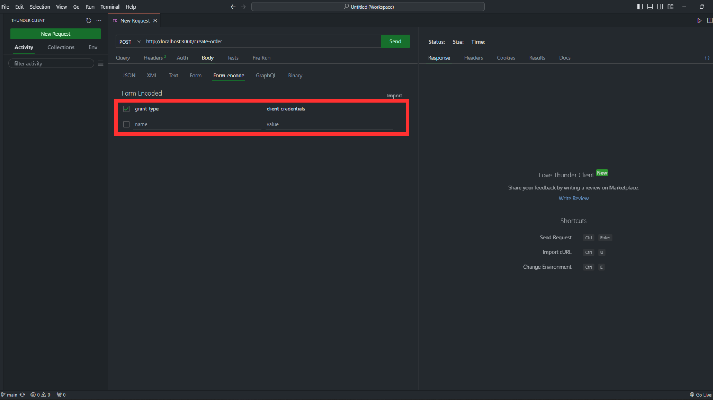

# NODEJS-PAYPAL



## INTRODUCTION

In this project we will create a **Node.js** application integrating the **PayPal** payment method through its REST API service for developers.
We will create a business account and a user account to make a payment order, capture it and cancel it if we want.

## TECHNOLOGIES

- Node.js
- Express.js
- Babel

## INSTALLATION

1. Install the recommended version for most users of **Node.js** from the following link.

https://nodejs.org/en

2. Use the **npm** package manager to install.
3. Execute the command from the terminal located at ./NODEJS-PAYPAL.

```shell
npm i
```

4. Create a **PayPal** account through the following link.

https://www.paypal.com/ar/webapps/mpp/business

5. Login with your account through the following link.

https://developer.paypal.com/home

6. Make sure you are in "sandbox mode".

<br />



<br />

7. Go to "Testing Tools" => "Sandbox Accounts" => "Create account" => "Create".

<br />



<br />

8. Create an account of type "Business (Merchant account)" assigning it a fictitious country, email and password.
9. Go to "Apps & Credentials" => "Create App".

<br />



<br />

10. Create an account of type "Merchant (Accept payments as merchant (seller))" by assigning it a fictitious name and the sandbox account created earlier.
11. Create an .env file inside ./NODEJS-PAYPAL and replace `Client ID` and `Secret key` with the API credentials.

```js
PAYPAL_API = 'https://api-m.sandbox.paypal.com'
PAYPAL_API_CLIENT = 'Client ID'
PAYPAL_API_SECRET = 'Secret key'
HOST = localhost
PORT = 3000
```

<br />



<br />

12. Go again to "Testing Tools" => "Sandbox Accounts" => "Create account" => "Create".
13. Create an account of type "Personal (Busher account)" assigning it a fictitious country, email, password, first name, last name and PayPal balance.
14. In the payment.controller.js file located in the controllers folder replace the `country currency code`, `price`, `description` and `sandbox account name` values of the "createOrder" function with those of your created sandbox account.

```js
purchase_units: [
	{
		amount: {
			currency_code: 'country currency code',
			value: 'price',
		},
		description: 'description',
	},
],
application_context: {
	brand_name: 'sandbox account name',
	landing_page: 'LOGIN',
	user_action: 'PAY_NOW',
	return_url: `http://${HOST}:${PORT}/capture-order`,
	cancel_url: `http://${HOST}:${PORT}/cancel-order`,
}
```

## EXECUTION

15. Use the **npm** package manager to run.
16. Execute the command from the terminal located at ./NODEJS-PAYPAL.

```shell
npm run dev
```

17. Make a POST request through an app or extension of testing API's, such as Postman or Thunder Client.
18. Select the "Auth" => "Basic" tab and insert in the username and password fields the API credentials, `Client ID` and `Secret key`.

<br />



<br />

19. Select the "Body" => "Form-encode" tab and insert in the name and value fields, "grant_type" and "client_credentials".

<br />



<br />

20. Send the request to the URL "http://localhost:3000/create-order".
21. Once you have made your purchase through the site you can verify the transactions by logging in with your personal and business accounts from the following link.

https://www.sandbox.paypal.com/signin

## LICENSE

All fonts are copyright of [Wizards of the Coast](http://magicthegathering.com).

CSS released under the [MIT license](https://github.com/Saeris/typeface-beleren-bold/blob/master/LICENSE.md).
